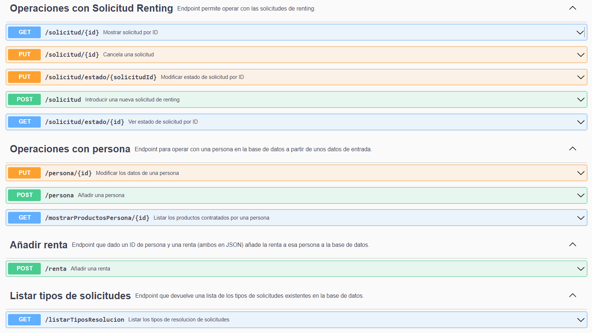
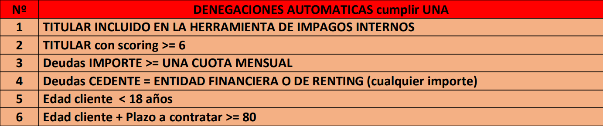

# Vehicle Renting Approval

API REST de Scoring con autoaprobación de solicitudes. Se pueden consultar sus endpoints actualizados después de instalarlo en la documentación de swagger pudiendo ser consultada [aquí](http://localhost:8080/swagger-ui/index.html). A continuación se muestra el estado de la documentación a dia 13/04/2023:




# Reglas de aprobación

Para que una solicitud de renting sea preaprobada automáticamente deben cumplirse todas las reglas de aprobación y ninguna de denegación.





# Cómo instalar
## Dependencias


### Java 11 -> [Enlace](https://oracle.com/es/java/technologies/javase/jdk11-archive-downloads.html)

### Maven-> [Enlace](https://maven.apache.org/download.cgi)

## Instalación y ejecución
+ Clonar el repositorio
```
git clone https://github.com/andresguijarro-babel/VehicleRentingApproval.git
```

+ Entrar en el directorio
  
```
cd VehicleRentingApproval
```

+ Arrancarlo con Maven

 ```
mvn spring:boot run
```
## Consultar la documentación una vez instalado y arrancado

```
http://localhost:8080/swagger-ui/index.html
```